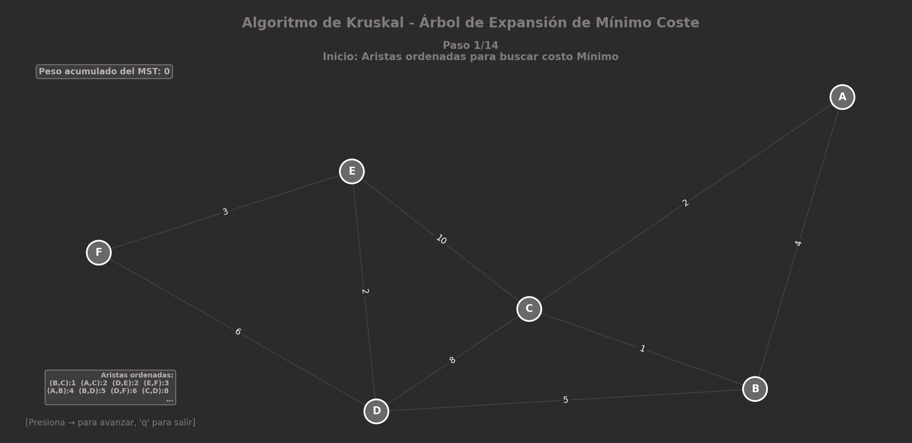
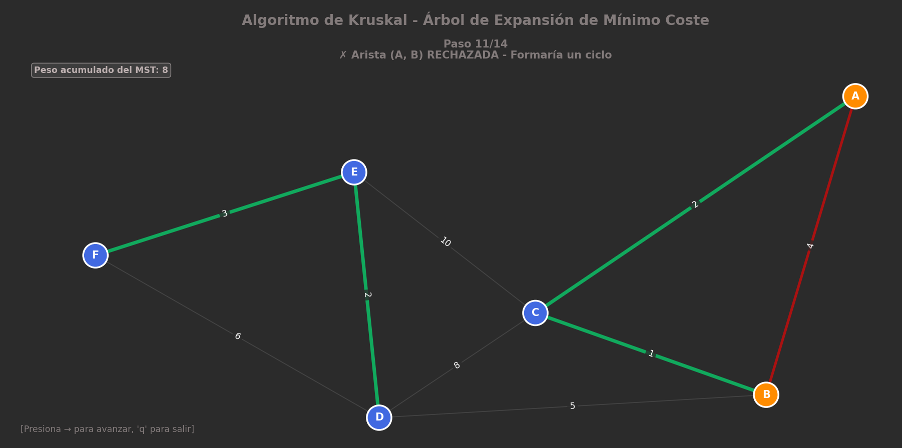
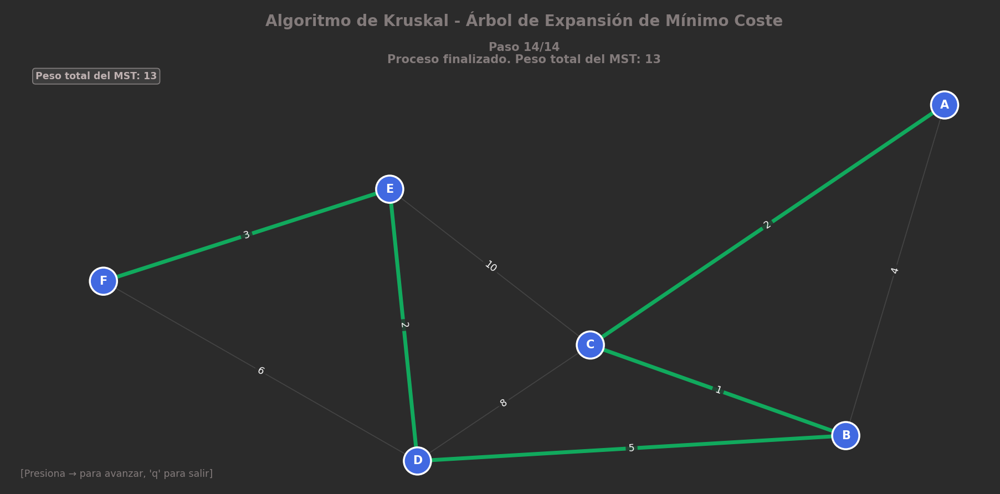
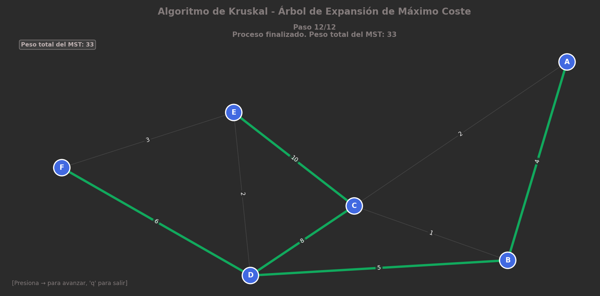

# Práctica 5: Algoritmo de Kruskal (IA)

Este repositorio contiene la implementación en Python del **Algoritmo de Kruskal**, desarrollado como parte de la materia de Inteligencia Artificial. El proyecto destaca por su capacidad dual: permite calcular tanto el **Árbol de Expansión Mínima (MST)** como el **Árbol de Expansión Máxima (MaxST)** mediante una visualización gráfica interactiva.

## ¿Qué es el Algoritmo de Kruskal?

El algoritmo de Kruskal es un método "codicioso" (greedy) que busca conectar todos los nodos de un grafo evitando ciclos.

* **Expansión Mínima (MST):** Busca conectar el grafo con el **menor costo** posible (prioriza aristas ligeras). Útil para ahorro de recursos.
* **Expansión Máxima (MaxST):** Busca conectar el grafo con el **mayor costo** o beneficio posible (prioriza aristas pesadas). Útil en ancho de banda o confiabilidad de redes.

### ¿Cómo funciona?
1.  **Ordenamiento Flexible:**
    * Para **Mínimo**: Ordena las aristas de menor a mayor peso (ascendente).
    * Para **Máximo**: Ordena las aristas de mayor a menor peso (descendente).
2.  **Inicialización:** Trata a cada nodo como un conjunto independiente.
3.  **Unión (Union-Find):** Recorre la lista ordenada. Si una arista conecta dos nodos de conjuntos diferentes (no forma ciclo), la acepta y une los conjuntos.
4.  **Finalización:** Termina al seleccionar $V-1$ aristas.


---

## Sobre el Código

Este script implementa la lógica del algoritmo combinándola con una interfaz gráfica.

**Características principales:**
* **Modo Dual (Min/Max):** El código permite alternar entre buscar el costo mínimo o máximo cambiando un simple parámetro (`minimize=True/False`).
* **Estructura Union-Find:** Implementación eficiente para la detección de ciclos.
* **Visualización Detallada:** Muestra el grafo, resalta la arista bajo evaluación y distingue entre aristas aceptadas (dorado) y rechazadas (rojo).

---

## Visualización y Resultados

En esta sección se muestra el funcionamiento del algoritmo en sus dos modalidades.

### 1. Grafo Inicial
> *Estado inicial del grafo con todos sus pesos.*



### 2. Proceso de Selección (Unión de Componentes)
> *Fase intermedia: El algoritmo evalúa aristas una por una. Se observa cómo se van uniendo componentes disconexos. Las aristas rojas indican ciclos evitados.*



### 3. Resultados Finales

#### A. Árbol de Expansión Mínima (MST)
> *Conexión total priorizando los costos más bajos.*




#### B. Árbol de Expansión Máxima (MaxST)
> *Conexión total priorizando los pesos más altos (rutas de mayor capacidad).*




---

## Cómo ejecutar

Para correr este proyecto en tu máquina local:

1.  Clona el repositorio:
    ```bash
    git clone [https://github.com/AlanDorantesVerdin/IA_P3_AlgoritmoKruskal.git]
    ```
2.  Navega a la carpeta:
    ```bash
    cd IA_P3_AlgoritmoKruskal
    ```
3.  Ejecuta el script principal:
    ```bash
    python Algoritmo_Kruskal.py
    ```
    *Nota: Puedes modificar la línea `kruskal_viz = KruskalVisual(G, minimize=True)` en el archivo `Algoritmo_Kruskal.py` a `False` para ver la Expansión Máxima.*

---

## Autor

* **Alan Dorantes Verdin** - [GitHub Profile](https://github.com/AlanDorantesVerdin)